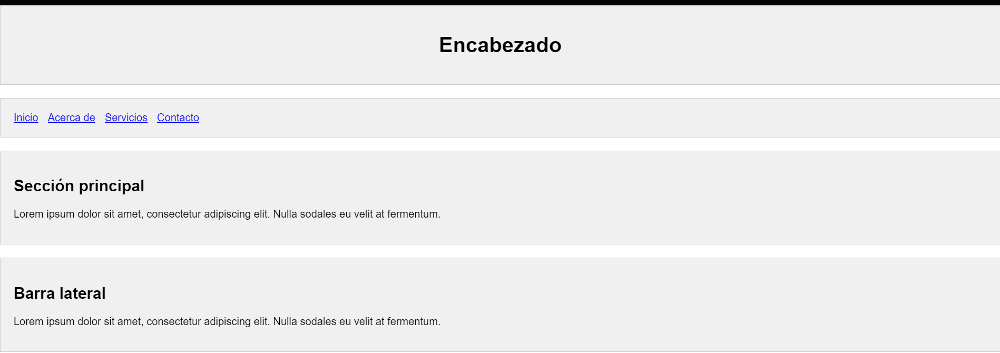
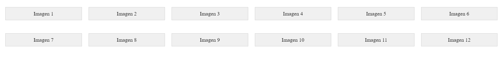
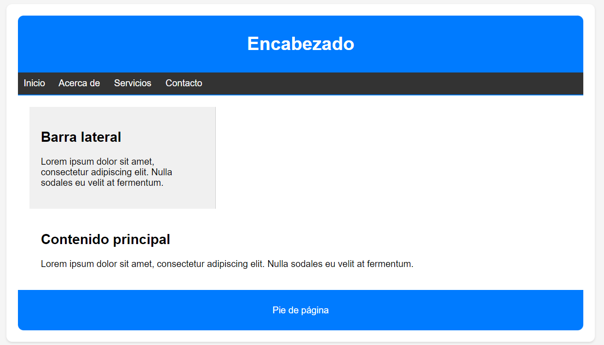

# Tareas del modulo

Las tareas de los módulos son pensadas para profundizar en los temas expuestos e interiorizar más el conocimiento.

## Tareas

1. Usando las propiedades vistas sobre el concepto de box model o modelo de caja intenta replicar las siguentes páginas web:
    - Figura no. 1
    
    - Figura no. 2
    
    - Figura no. 3
    
    - Figura no. 4
    
